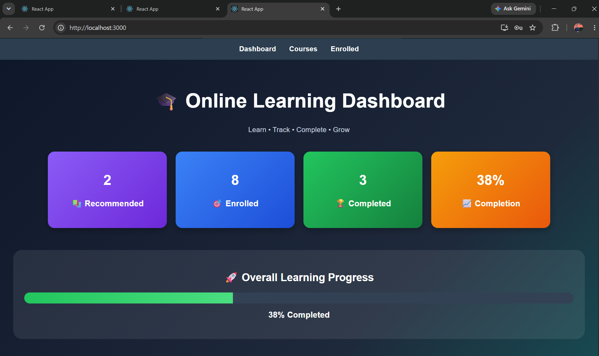
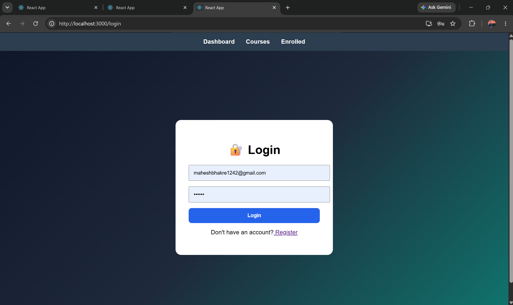
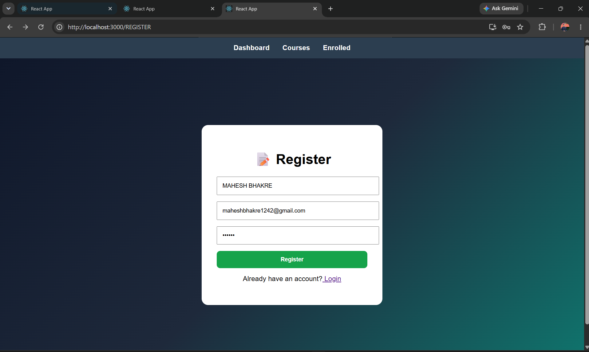

# 🎓 Online Learning Course Recommendation Platform


---

## 📌 Overview

Online Learning Course Recommendation Platform is a full-stack web application built using React.js, Node.js, and Express.js.

The platform helps users discover courses, enroll in learning programs, track course progress, and analyze learning performance through an interactive dashboard.

Users can:

* 🎓 Register & Login
* 📚 Browse Available Courses
* 🔍 Search Courses
* 📂 Filter Courses by Category
* ✅ Enroll in Courses
* 📈 Track Learning Progress
* 📊 View Learning Analytics
* ⭐ Get Course Recommendations
* 🚀 Monitor Course Completion Status
* 💾 Store Data Using JSON-Based Storage

---

## 📊 Project Screenshots

### 🏠 Dashboard



---

### 🔐 User Login



---

### 📝 User Registration



---

### 📚 All Courses


---

### 🎓 My Enrolled Courses


---

### 📈 Learning Analytics


---

### 🚀 Course Progress Tracking


---

## 🛠 Problem Statement

Online learners often face challenges in discovering relevant courses, tracking progress, and monitoring learning achievements.

Common issues include:

* ❌ No centralized learning dashboard
* ❌ Difficulty tracking enrolled courses
* ❌ Lack of learning analytics
* ❌ No structured course recommendation system
* ❌ Poor visibility of learning progress

---

## ✅ Solution

This project provides:

* User Authentication System
* Course Recommendation Engine
* Course Enrollment System
* Progress Tracking Dashboard
* Learning Analytics
* Search & Filter Functionality
* Personalized Learning Experience
* REST API Integration
* Persistent Data Storage

---

## 🏭 Industry Relevance

| Industry     | Use Case                    |
| ------------ | --------------------------- |
| Education    | Online Learning             |
| EdTech       | Course Recommendation       |
| Training     | Employee Upskilling         |
| Universities | Learning Management         |
| Startups     | Skill Development Platforms |

---

## 📊 Business Impact

* ⚡ Better learner engagement
* 🎓 Improved course completion rates
* 📈 Learning performance monitoring
* 🚀 Personalized recommendations
* 📊 Data-driven educational insights

---

## ⚙ Tech Stack

### Frontend

* React.js
* React Router DOM
* Axios
* JavaScript
* CSS

### Backend

* Node.js
* Express.js
* REST APIs

### Storage

* JSON Files

### Tools

* Nodemon
* VS Code
* Git & GitHub

---

## 🏗 System Architecture

```text
User
 ↓
React Frontend
 ↓
Axios API Calls
 ↓
Express.js Server
 ↓
Controllers
 ↓
JSON Data Storage
```

---

## 📁 Project Structure

```text
Online-Learning-Course-Recommendation-Platform/
│
├── client/
│   ├── src/
│   │   ├── pages/
│   │   │   ├── Dashboard.js
│   │   │   ├── Courses.js
│   │   │   ├── EnrolledCourses.js
│   │   │   ├── Login.js
│   │   │   └── Register.js
│   │   │
│   │   ├── App.js
│   │   └── index.js
│   │
│   └── package.json
│
├── server/
│   ├── controllers/
│   ├── routes/
│   ├── data/
│   ├── server.js
│   └── package.json
│
├── images/
│   ├── dashboard.png
│   ├── login.png
│   ├── register.png
│   ├── all cources.png
│   ├── my enrolled cources.png
│   ├── enrolled 2.png
│   └── lerning analytics.png
│
├── README.md
└── package.json
```

---

## ⚙ Installation & Setup

```bash
git clone https://github.com/maheshbhakre/Online-Learning-Course-Recommendation-Platform.git

cd Online-Learning-Course-Recommendation-Platform
```

---

## 🖥 Run Backend

```bash
cd server

npm install

npm run dev
```

---

## 🖥 Run Frontend

```bash
cd client

npm install

npm start
```

---

## 🌐 Open Application

```text
http://localhost:3000
```

Backend:

```text
http://localhost:5000
```

---

## ✨ Key Features

* 🔐 User Registration
* 🔑 User Login
* 📚 Course Browsing
* 🔍 Search Courses
* 📂 Category Filtering
* ⭐ Course Recommendations
* ✅ Course Enrollment
* 📈 Progress Tracking
* 📊 Learning Analytics Dashboard
* 🚀 Completion Monitoring
* 💾 JSON-Based Data Storage
* 📱 Responsive User Interface

---

## 📸 Project Proof

All screenshots are available inside the **images** folder.

---

## 👨‍💻 Author

**Mahesh Bhakre**

---

## 🌐 CONNECT WITH ME

<a href="https://github.com/maheshbhakre">

</a>

<a href="https://www.linkedin.com/in/maheshbhakreds1242">

</a>

<a href="https://www.instagram.com/mahesh_bhakre__2k06">

</a>

<a href="https://saimfsd.github.io/mahesh-portfolio/">

</a>

---

## ⭐ Note

This project demonstrates:

* Full Stack Web Development
* React Component Architecture
* REST API Development
* Express.js Backend Development
* State Management Using Hooks
* Authentication Workflow
* Course Recommendation Logic
* Progress Tracking System
* Learning Analytics Dashboard
* Responsive UI Design

---

## 🚀 Future Improvements

* JWT Authentication
* MongoDB Database Integration
* AI-Based Course Recommendations
* Certificate Generation
* Course Ratings & Reviews
* Video Learning Modules
* Cloud Deployment
* Mobile Application

---

## 🎯 Interview Tip

"I built an Online Learning Course Recommendation Platform using React.js, Node.js, and Express.js where users can register, log in, browse courses, enroll in learning programs, track course progress, view learning analytics, and receive personalized course recommendations through a modern full-stack web application."
